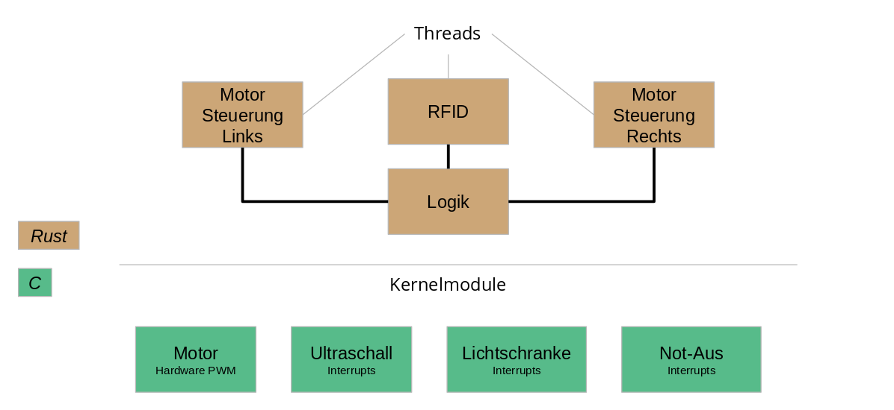
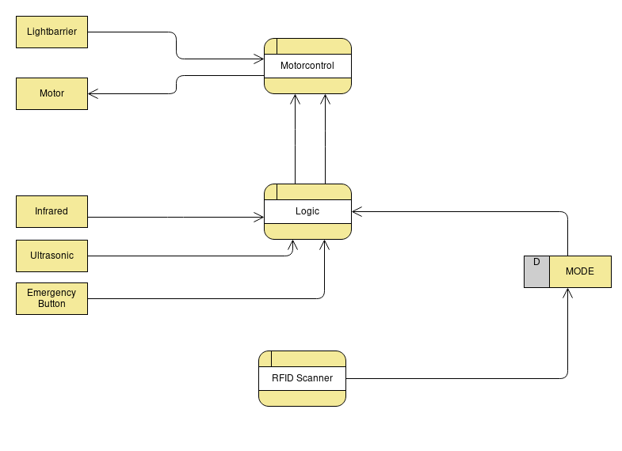
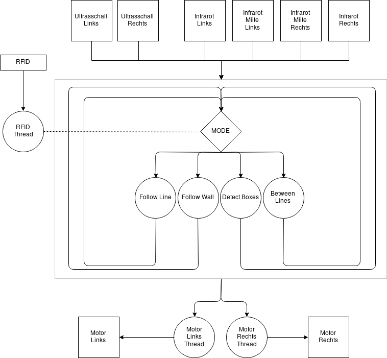

# Realzeitsysteme RoboCar

by Joshua Rutschmann

## Anforderungen
Das RoboCar sollte eine Rampe mit ca 45° überwinden, ein Labyrinth per Ultrasschall durchqueren, einer Linie folgen und sich drehen, um Boxen zu finden und zwischendurch zu fahren. Außerdem sollte ein Geschwindigkeitsregler vorhanden sein, der voreingestellte mm/s für die Motoren einhält.

## Tests

- IO, CPU, NET Burn
- Reaktionszeiten messen
- Realzeitnachweis

## Hardware
- Raspberry Pi 3B+
- H-Brücke
- HC-SR04 Ultraschall Module
- Infrarotsensoren
- Lichtschranken

Benutzt werden zwei Leitungen pro Echo Pin der Ultraschall Module. Dies hat den Grund, dass sowohl die fallende als auch die steigende Flanke über Interrupts im Kernel detektiert werden sollen.
Anstatt dem vorinstallierten RFID Lesegerät wird ein RC522 RFID Lesegerät mit **originalem** MRFC522 Chip verwendet. Dieser funktioniert mit dem [mrfc522](https://github.com/japaric/mfrc522) crate und hat schnelle Lesezeiten und -distanzen.

## Systemsoftware

Als Betriebssystem dient DietPi mit dem 4.14 Realtime Kernel (4.14.91-rt49-v7+ #4 SMP PREEMPT RT). In den erweiterten Kerneleinstellungen (menuconfig) wurde der performance governor ausgewählt, damit der RPi im Leerlauf nicht heruntertaktet. Außerdem sind die dynamischen idle ticks abgeschaltet.

Rust wird mit _arm-linux-gnueabihf-gcc_ für den Raspberry Pi cross kompiliert
Um die Motorsteuerung so effizient und schnell wie möglich zu machen, habe ich "linux/pwm.h" benutzt. Dazu musste ich davor ein [device tree overlay schreiben](drivers/motor/configure_pwm.dts)
Die Pullups für die Lichtschranken wurden über ein [anderes overlay](drivers/lightbarrier/configure_pullups.dts) aktiviert.
Hier ein Auszug der config.txt des System:

```
#-------SPI-------------
dtparam=spi=on

#-------My Overlays-----
device_tree_overlay=overlays/configure_pullups.dtb
device_tree_overlay=overlays/configure_pwm.dtb
```

## Rust

### Abhängigkeiten
- **rust_gpiozero** - Um Infrarotsensoren auszulesen
- **nix** - Um Signale zu behandeln
- **mfrc522 & linux-embedded-hal** - RFIDs lesen
- **libc** - Zeiten messen, CPU pinning & scheduler setzen

### Eigene Module
- hardware
- logging

Das Modul `hardware` enthält einen RFID wrapper um die _unschöne_ Initialisierung des mrfc522 crate versteckt. Außerdem existieren die Structs `Motor` und `Device` die auf die Kernelmodule lesen und schreiben können. Das Motor-Struct erstellt einen Thread, der die Geschwindigkeitregelung enthält.

Die Geschwindigkeit kann entweder direkt (prozentual, als PWM Wert) oder als mm/s Wert gesetzt werden. 

## Systementwurf


Der Not-Aus Treiber schickt ein SIGUSR1 Signal an das Rust-Main-Programm. Dort wird dann der Buttondruck behandelt. Im aktuellen Fall wird der Modus auf Idle gesetzt.
Die Logik überprüft jeden Schleifendurchlauf, welchen Wert die Mode Variable hat. Demnach liegt die Reaktionszeit auf Knopfdruckte

## Datenfluss


## Kontrollfluss
Man sieht, dass die (statische) MODE Variable über das Verhalten des Programms entscheidet.





## Realzeitnachweis (hinreichend)
| Task        | tPmin / tDmax | tEmax  | tEmin   | Auslastung |
|-----------------|---------------|----------|---------|------------|
| Motor           | 100ms         | 0,295ms  | 0,091ms | 0,295%     |
| RFID            | 30ms          | 15,771ms | 2,295ms | 52,57%     |
| Linie folgen    | 20ms          | 0,381ms  | 0,262ms | 1,905%     |
| Wand folgen     | 20ms          | 0,544ms  | 0,152ms | 2,72%      |
| Zwischen Linien | 20ms          | 5,523ms  | 5,177ms | 27,615%    |

Für ein 1-Prozessorsystem sieht man, dass die Auslastung nicht kleiner als 73,5%, geschweige denn 73,5% / π ist.

>0,295% + 52,57% + 27,615% = 80,48%

>80,48% ≮ 73,5%

Die Blockierzeiten für den globalen _MODE_ werden außen vor gelassen, da der Logik Thread zu ~99% der Zeit nur vom Atomic liest.

## Realzeitnachweis (notwendig)

| Taskset                           | Maximale Reaktionszeit | Maximal zulässige Reaktionszeit |
|-----------------------------------|------------------------|-----------------------|
| RFID, Follow Line, Motorcontrol   | 16,447ms               | 20ms                  |
| RFID, Follow Wall, Motorcontrol   | 16,610ms               | 20ms                  |
| RFID, Between Lines, Motorcontrol | 27,112ms               | 20ms                  |

Die maximal zulässige Reaktionszeit ergibt sich aus der kleinsten Deadline. 

In der letzten Zeile sieht man, dass das Taskset diese Reaktionszeit überschreitet. Das liegt daran, dass im "Between Lines" Modus 5 Millisekunden geschlafen wird. Nun könnte man Pmin mit 20ms erhöhen, um die Dealine einzuhalten. Die könnte jedoch dazu führen, dass der Roboter den Parkour nicht mehr einwandfrei schafft. Oder man ersetzt das Sleep durch einen counter, der den Motor aktiviert hält.


# Fazit

Der Geschwindigkeitsregler ist weder P-Regler noch ein PID-Regler. Er hat eine feste prozentuale Korrektur. Dies hat sich zwar als überraschend gut herausgestellt jedoch wäre ein PID Rgler eine schöne Sache und alles im Kernelmodul mit (HR-)Timern zu verpacken habe cih mir noch überlegt, aber nie umgesetzt. 